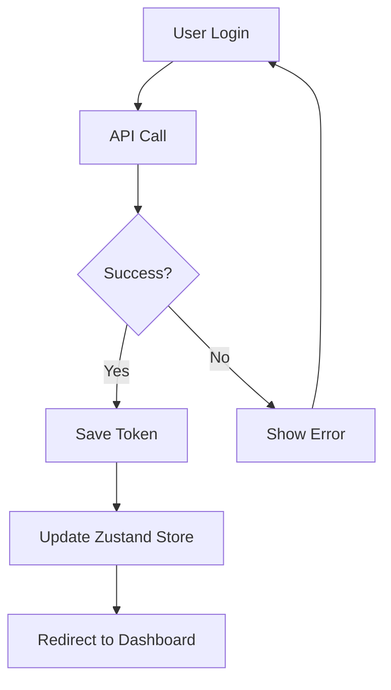

# 🏗️ Mimari Dokümantasyon

## Genel Bakış

Bu proje, modern React ekosistemi ile geliştirilmiş, feature-based mimari kullanan bir single-page application'dır.

## Mimari Prensipler

### 1. Feature-Based Organization
Her özellik kendi bağımsız modülünde organize edilmiştir:
```
features/
  ├── auth/          # Authentication işlemleri
  ├── admin/         # Admin paneli özellikleri
  │   ├── dashboard/
  │   ├── students/
  │   └── ...
  └── driver/        # Şoför paneli özellikleri
```

**Avantajları:**
- Kod bölümleme (code splitting) kolaylığı
- Bağımsız geliştirme ve test
- Yeniden kullanılabilirlik
- Bakım kolaylığı

### 2. Separation of Concerns

#### Presentation (UI) Layer
- **Components**: Görsel elementler
- **Pages**: Route'lara bağlı sayfalar
- Sadece UI render'dan sorumlu

#### Business Logic Layer
- **Hooks**: Veri yönetimi ve iş mantığı
- **Services**: API iletişimi
- **Utils**: Yardımcı fonksiyonlar

#### State Management Layer
- **Zustand**: Global app state (auth vb.)
- **TanStack Query**: Server state
- **React State**: Local component state

### 3. Type Safety
- Her değişken, prop ve fonksiyon tip tanımlı
- Strict TypeScript konfigürasyonu
- Runtime hataları minimize edilmiş

## Klasör Yapısı Detayları

### `/src/components`
Reusable ve genel componentler:

```typescript
// common/ - Proje genelinde kullanılabilir
Button, Input, Card, Modal, Table, Loading

// layouts/ - Sayfa layout'ları
PublicLayout, AdminLayout, DriverLayout
```

### `/src/features`
Feature-specific kodlar:

```typescript
// Her feature kendi içinde organize
feature-name/
  ├── components/    # Feature-specific components
  ├── hooks/         # Feature-specific hooks
  ├── pages/         # Route pages
  ├── services/      # API services
  └── types/         # Type definitions
```

### `/src/services`
API iletişim katmanı:

```typescript
// Axios wrapper ile
class MyService {
  async getAll() { }
  async getById(id) { }
  async create(data) { }
  async update(id, data) { }
  async delete(id) { }
}
```

### `/src/hooks`
Custom React hooks:

```typescript
// Data fetching hooks
useAuth() - Authentication
useBuses() - Bus management
useUsers() - User management

// UI hooks
useModal() - Modal state
useDebounce() - Debounced value
```

### `/src/store`
Global state management (Zustand):

```typescript
// auth-store.ts
interface AuthState {
  user: User | null;
  token: string | null;
  isAuthenticated: boolean;
  setAuth: (user, token) => void;
  clearAuth: () => void;
}
```

## Data Flow

### 1. Server State (TanStack Query)
```
UI Component
  ↓
Custom Hook (useAuth, useBuses)
  ↓
Service Layer (authService, busService)
  ↓
Axios Instance
  ↓
Backend API
```

### 2. Global State (Zustand)
```
Action Trigger
  ↓
Store Action (setAuth, clearAuth)
  ↓
Store State Update
  ↓
Component Re-render
```

### 3. Local State (useState)
```
User Interaction
  ↓
Event Handler
  ↓
setState
  ↓
Component Re-render
```

## Authentication Flow



## Routing Structure

```typescript
/                           # Landing page (public)
/login                      # Driver login (public)
/admin/login               # Admin login (public)

/admin/*                   # Protected (admin only)
  ├── /dashboard
  ├── /students
  ├── /drivers
  ├── /buses
  ├── /routes
  ├── /planning
  └── /reports

/driver/*                  # Protected (driver only)
  ├── /dashboard
  ├── /boarding
  └── /alighting
```

## API Integration

### Axios Instance Configuration
```typescript
// Interceptors
- Request: Add auth token
- Response: Handle errors globally
```

### API Endpoints
```typescript
// config/api.config.ts
export const API_ENDPOINTS = {
  auth: { login, logout, me },
  users: { list, detail, create, update, delete },
  buses: { list, detail, create, update, delete },
  // ...
};
```

### Error Handling
- HTTP status codes → User-friendly messages
- Network errors → Retry logic
- 401 Unauthorized → Auto logout + redirect

## State Management Strategy

### When to use what?

**Zustand (Global State):**
- Authentication state
- User preferences
- App-wide settings

**TanStack Query (Server State):**
- API data
- Cache management
- Automatic refetching
- Optimistic updates

**useState (Local State):**
- Form inputs
- UI toggles
- Modal states
- Component-specific data

## Performance Optimizations

### 1. Code Splitting
```typescript
// Route-based splitting (automatic with Vite)
const AdminDashboard = lazy(() => import('./features/admin/dashboard'));
```

### 2. Memoization
```typescript
// useMemo for expensive calculations
const filteredData = useMemo(() => filter(data), [data]);

// useCallback for handlers
const handleClick = useCallback(() => {}, []);
```

### 3. Query Optimization
```typescript
// Stale time configuration
{
  staleTime: 5 * 60 * 1000, // 5 minutes
  cacheTime: 10 * 60 * 1000, // 10 minutes
}
```

### 4. Asset Optimization
- SVG icons (lucide-react)
- Image lazy loading
- Font optimization

## Security Measures

### 1. Authentication
- JWT tokens
- HttpOnly cookies (backend)
- Token refresh mechanism

### 2. Authorization
- Route guards
- Role-based access control
- API-level checks

### 3. XSS Prevention
- React auto-escaping
- DOMPurify for user content
- CSP headers

### 4. CSRF Protection
- Cookie-based tokens
- SameSite cookie attribute

## Testing Strategy

### Unit Tests
```typescript
// Component testing
describe('Button', () => {
  it('renders correctly', () => {});
  it('handles click', () => {});
});
```

### Integration Tests
```typescript
// Feature testing
describe('Login Flow', () => {
  it('logs in successfully', () => {});
});
```

### E2E Tests (Future)
- Playwright or Cypress
- Critical user flows

## Build & Deployment

### Development
```bash
npm run dev
# Vite dev server with HMR
# Port: 5173
```

### Production
```bash
npm run build
# Output: dist/
# Minified, optimized, tree-shaken
```

### Environment Variables
```env
VITE_API_BASE_URL=http://localhost:3001
VITE_API_TIMEOUT=30000
VITE_APP_ENV=development
```

## Best Practices

### 1. Component Design
- Single Responsibility Principle
- Composition over inheritance
- Props validation with TypeScript

### 2. Hooks Usage
- Extract complex logic to custom hooks
- Follow hooks rules
- Proper dependency arrays

### 3. Styling
- TailwindCSS utility classes
- Component-specific styles when needed
- Responsive design first

### 4. Error Handling
- Try-catch for async operations
- Error boundaries for React errors
- User-friendly error messages

### 5. Code Organization
- Group related files
- Consistent naming
- Meaningful file names

## Future Improvements

### Technical
- [ ] PWA support
- [ ] Offline mode
- [ ] Real-time updates (WebSocket)
- [ ] Enhanced error tracking (Sentry)

### Features
- [ ] Multi-language support (i18n)
- [ ] Dark mode
- [ ] Advanced filtering
- [ ] Export functionality
- [ ] Push notifications

### Testing
- [ ] Increase test coverage
- [ ] E2E tests
- [ ] Performance testing
- [ ] Accessibility testing

## Maintenance

### Regular Tasks
1. Dependency updates (monthly)
2. Security audits (npm audit)
3. Performance monitoring
4. Code reviews
5. Documentation updates

### Monitoring
- Error logging
- Performance metrics
- User analytics
- API response times

## Conclusion

Bu mimari, modern web uygulaması standartlarına uygun, ölçeklenebilir ve bakımı kolay bir yapı sunmaktadır. Feature-based organization, type safety ve separation of concerns prensipleri sayesinde büyük ekiplerde bile verimli çalışma sağlar.

